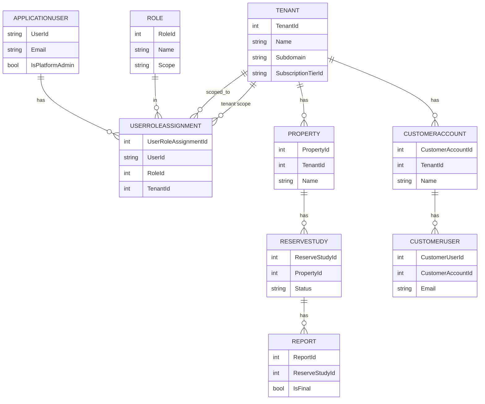

```mermaid
erDiagram
    TENANT {
        int TenantId
        string Name
        string Subdomain
        string SubscriptionTierId
    }

    APPLICATIONUSER {
        string UserId
        string Email
        bool IsPlatformAdmin
    }

    ROLE {
        int RoleId
        string Name
        string Scope
    }

    USERROLEASSIGNMENT {
        int UserRoleAssignmentId
        string UserId
        int RoleId
        int TenantId
    }

    PROPERTY {
        int PropertyId
        int TenantId
        string Name
    }

    RESERVESTUDY {
        int ReserveStudyId
        int PropertyId
        string Status
    }

    REPORT {
        int ReportId
        int ReserveStudyId
        bool IsFinal
    }

    CUSTOMERACCOUNT {
        int CustomerAccountId
        int TenantId
        string Name
    }

    CUSTOMERUSER {
        int CustomerUserId
        int CustomerAccountId
        string Email
    }

    TENANT ||--o{ PROPERTY : has
    PROPERTY ||--o{ RESERVESTUDY : has
    RESERVESTUDY ||--o{ REPORT : has

    TENANT ||--o{ CUSTOMERACCOUNT : has
    CUSTOMERACCOUNT ||--o{ CUSTOMERUSER : has

    APPLICATIONUSER ||--o{ USERROLEASSIGNMENT : has
    ROLE ||--o{ USERROLEASSIGNMENT : in
    TENANT ||--o{ USERROLEASSIGNMENT : scoped_to

    TENANT ||--o{ USERROLEASSIGNMENT : "tenant scope"

```
