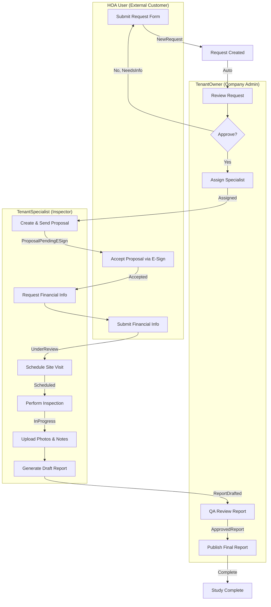
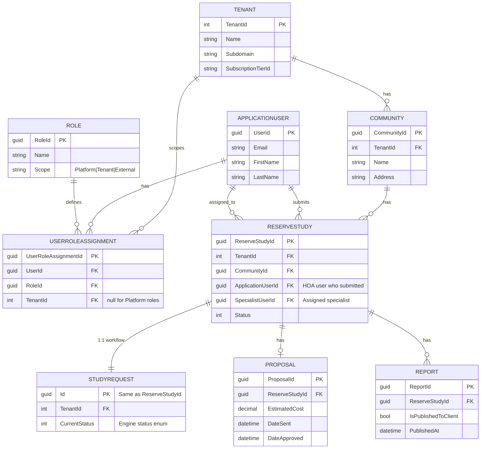

# Role Definitions & Workflow

## Role Hierarchy

| Scope | Role | Policy | Description |
|-------|------|--------|-------------|
| **Platform** | PlatformAdmin | `RequirePlatformAdmin` | SaaS owner, can access all tenants |
| **Platform** | PlatformSupport | - | Limited global read/support (optional) |
| **Tenant** | TenantOwner | `RequireTenantOwner` | Company admin, reviews requests, assigns specialists, publishes reports |
| **Tenant** | TenantSpecialist | `RequireTenantStaff` | Performs inspections, creates proposals, drafts reports |
| **Tenant** | TenantViewer | `RequireTenantViewer` | Read-only internal staff |
| **External** | HOAUser | `RequireHOAUser` | HOA board member, submits requests, accepts proposals |
| **External** | HOAAuditor | `RequireHOAUser` | Read-only access for compliance review |

### Who is "Staff"?

**"Staff" = TenantOwner + TenantSpecialist**

These are internal employees of the reserve study company (tenant). The `RequireTenantStaff` policy allows access to both roles.

---

## Reserve Study Workflow - Who Does What

---

## Workflow Status Transitions by Role

| From Status | To Status | Who Can Do This | Action |
|-------------|-----------|-----------------|--------|
| NewRequest | PendingDetails | System | Auto when elements added |
| PendingDetails | ReadyForReview | System | Auto when all data complete |
| ReadyForReview | **Approved** | **TenantOwner** | Reviews & approves request |
| ReadyForReview | NeedsInfo | **TenantOwner** | Requests more info from HOA |
| NeedsInfo | ReadyForReview | HOAUser | Provides requested info |
| Approved | **Assigned** | **TenantOwner** | Assigns a specialist |
| Assigned | ProposalPendingESign | **TenantSpecialist** | Creates & sends proposal |
| ProposalPendingESign | **Accepted** | **HOAUser** | E-signs the proposal |
| ProposalPendingESign | Rejected | HOAUser | Rejects proposal |
| Accepted | Scheduled | TenantSpecialist | Schedules site visit |
| Scheduled | InProgress | TenantSpecialist | Starts inspection |
| InProgress | UnderReview | TenantSpecialist | Uploads data |
| UnderReview | ReportDrafted | TenantSpecialist | Generates report |
| ReportDrafted | **ApprovedReport** | **TenantOwner** | QA approves report |
| ApprovedReport | **Complete** | **TenantOwner** | Publishes to HOA |
| Complete | Archived | System | Auto after time period |

---

## Data Model

---

## Page Access by Role

| Page/Feature | PlatformAdmin | TenantOwner | TenantSpecialist | TenantViewer | HOAUser |
|--------------|:-------------:|:-----------:|:----------------:|:------------:|:-------:|
| `/Admin/*` | ✅ | ❌ | ❌ | ❌ | ❌ |
| `/ReserveStudies/Create` | ✅ | ✅ | ✅ | ❌ | ❌ |
| `/ReserveStudies/Request` | ✅ | ✅ | ✅ | ❌ | ✅ |
| `/ReserveStudies/{id}/Details` | ✅ | ✅ | ✅ | ✅ | ✅* |
| Assign Specialist | ✅ | ✅ | ❌ | ❌ | ❌ |
| Send Proposal | ✅ | ✅ | ✅ | ❌ | ❌ |
| Accept Proposal | ❌ | ❌ | ❌ | ❌ | ✅ |
| Upload Photos/Notes | ✅ | ✅ | ✅ | ❌ | ❌ |
| Approve Report (QA) | ✅ | ✅ | ❌ | ❌ | ❌ |
| Publish Report | ✅ | ✅ | ❌ | ❌ | ❌ |
| Download Final Report | ✅ | ✅ | ✅ | ✅ | ✅ |

\* HOAUser can only see their own studies

---

## Summary: The Three User Types

### 1. **HOA Users** (External Customers)
- Submit reserve study requests
- Accept proposals (e-signature)
- Provide financial information
- Download final reports
- **Cannot** assign specialists, create proposals, or approve reports

### 2. **Tenant Staff** (Reserve Study Company Employees)
- **TenantOwner**: Reviews requests, assigns specialists, QA approves reports, publishes
- **TenantSpecialist**: Creates proposals, performs inspections, drafts reports
- **TenantViewer**: Read-only access to studies

### 3. **Platform Admin** (SaaS Owner - You)
- Full access to all tenants
- Manages subscriptions, tenants, global settings
